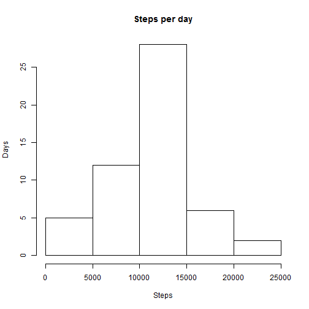
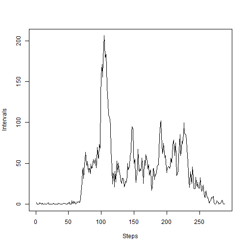
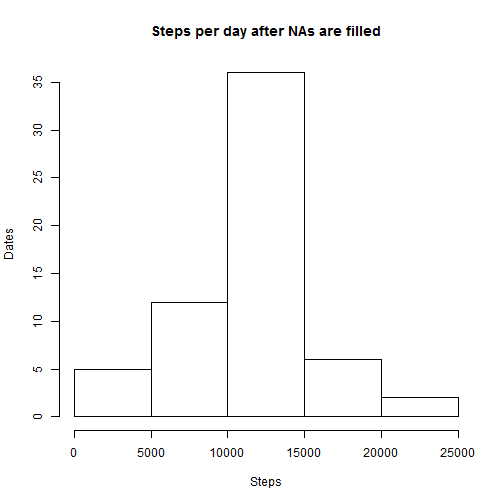
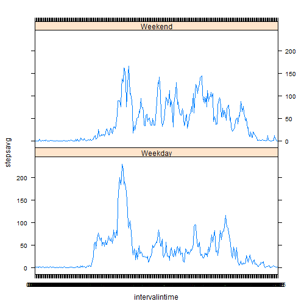

## Loading and preprocessing the data

First we are going to load the packages knitr, plyr, dplyr and lattice in order to be able to knitr the page, reorganize the data and produce plots.
And after that we are going to read the data with read.csv:


```r
library(knitr)  
library(plyr)  
library(dplyr)  
library(lattice)  
  
activitydata <- read.csv("activity.csv", header = TRUE, stringsAsFactors = FALSE)  
```


## What is mean total number of steps taken per day?
Next, we are going to add the steps per day, assign that value to the variable addsteps and make the histogram of those data:  


```r
addsteps <- aggregate(steps ~ date, data = activitydata, "sum")  
hist(addsteps$steps,xlab = "Steps", ylab = "Days", main = "Steps per day")  
```

 

In the next step we find the mean of the steps taken per each day, and produce the mean and median:  


```r
aves <- aggregate(steps ~ date, data = activitydata, mean)  
mean(addsteps[,2])  
```

```
## [1] 10766.19
```

```r
median(addsteps[,2])  
```

```
## [1] 10765
```


## What is the average daily activity pattern?
Here we are going to convert the column interval into a four digit value (i.e. 5 is going to be 0005, 10 is going to be 0010 etc), and then  
we are going to format it into a time format H:MM and finally add it as a new column in the dataset.  


```r
newintervals <- sprintf("%04d", activitydata$interval)  

intervalintime <- format(strptime(newintervals, format = "%H%M"), format = "%H:%M")  

mydata <- cbind(activitydata, intervalintime)  
```

We are calculating the mean of steps for each intervalintime (00:00 through 23:55), then we are plotting the values, findind the highest value and printing  
the value.


```r
databymin <- aggregate(steps ~ intervalintime, data = mydata, mean)  
plot(databymin$steps, type = "l", xlab = "Steps", ylab = "Intervals")
```

 

```r
maxsteps <- max(databymin[,2])
maxsteps
```

```
## [1] 206.1698
```


## Imputing missing values
After finding how many rows have NA values in the dataset, we create a new dataset that only contains those rows.  


```r
nanum <- sum(is.na(mydata))
nanum
```

```
## [1] 2304
```

```r
mysubset <- subset(mydata, is.na(mydata))
```


To substitute NAs with the mean for that 5 minute interval
for each date in mysubset we read the steps value on databymin (which is the data that holds 5min
intervals and mean of steps for that interval), and then we assign that value to the NA for that date and that interval on mysubset


```r
for(dt in mysubset$date){
	
	myset <- subset(databymin, databymin$intervalintime == mysubset$intervalintime)
	mysubset$steps <- databymin$steps

	}
```

Create the new dataset that holds all the data, and has NAs filled in same way as above. We create a nonarows dataset that holds only the rows  
with data filled in. Above we have created the dataset that holds only the rows with NA values, and filled those data in. So as a result  
we attach these two together to have a complete dataset with NA values filled in. After that we calculate the new sum of steps per day,   
we create the histogram, the mean and median.


```r
nonarows <- na.omit(mydata)

myOutput <- rbind(mysubset, nonarows)

orderdt <- myOutput[order(myOutput[,2]),]

totalsteps <- aggregate(steps ~ date, data = orderdt, "sum")
hist(totalsteps$steps, xlab = "Steps", ylab = "Dates", main = "Steps per day after NAs are filled")
```

 

```r
mean(totalsteps$steps)
```

```
## [1] 10766.19
```

```r
median(totalsteps$steps)
```

```
## [1] 10766.19
```


## Are there differences in activity patterns between weekdays and weekends?
To analyse the difference between the activity on the weekdays and the weekends we create a factor variable with levels Weekday and Weekend, convert  
the data from Date column into the Date type, then retrieve weekdays and create a new column with those values and add it to the dataframe with the name
weekday.And finally we plot the data to show the difference between the activity during the weekdays and weekend.


```r
dayfactor <- as.factor(c("Weekday", "Weekend"))
orderdt[,2] <- as.Date(orderdt[,2])
orderdt <- cbind(orderdt, weekdays(orderdt[,2]))
names(orderdt)[5] <- "weekday"

days <- weekdays(orderdt[,2])
datedays <- unique(days)

noweekend <- c("Monday", "Tuesday", "Wednesday", "Thursday", "Friday")
yesweekend <- c("Saturday", "Sunday")

mapeddays <- mapvalues(days, datedays, c(rep("Weekday", 5), c(rep("Weekend", 2))))

orderdt <- cbind(orderdt, mapeddays)
names(orderdt)[6] <- "day"


newdata <- group_by(orderdt, day, intervalintime)
myoutput <- summarise(newdata, stepsavg = mean(steps))
with(myoutput, xyplot(stepsavg~intervalintime|day, type = "l", layout=c(1,2)))
```

 
